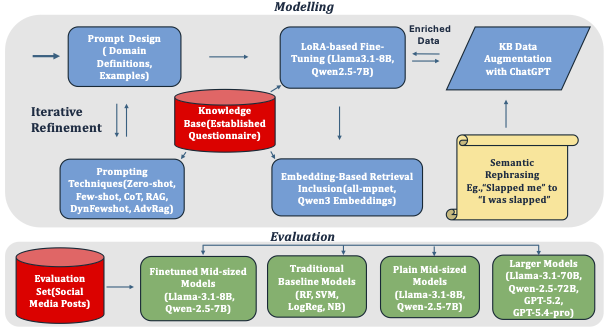
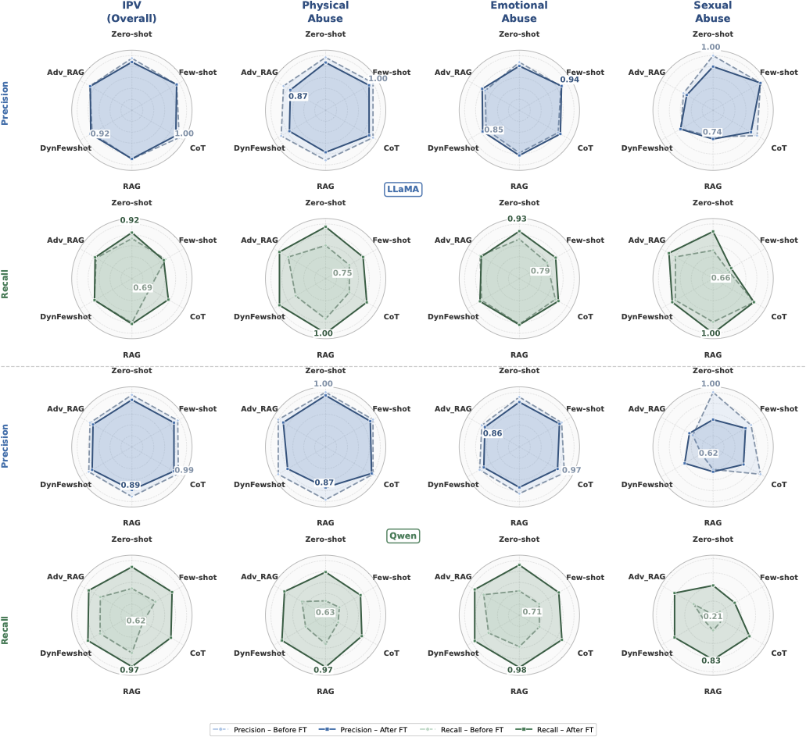
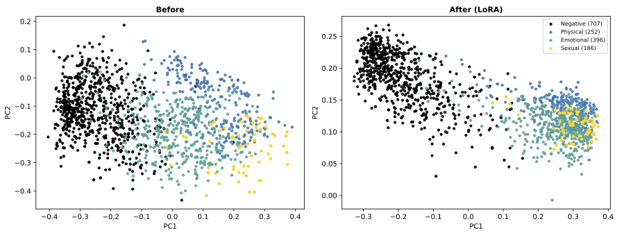

# Detection of Intimate Partner Violence with Large Language Models

## Overview

This repository documents the research on detecting Intimate Partner Violence (IPV) from unstructured text using Large Language Models (LLMs).

Detection of Intimate Partner Violence with Large Language Models includes

• Evaluated prompting, promting strategies, retrieval-augmented generation, embedding optimization, and LoRA-based domain adaptation for IPV detection.
• Benchmarked open-weight and proprietary LLMs across physical, emotional, and sexual abuse categories.
• Developed domain-adapted mid-sized LLMs that outperformed larger untuned models.
• Repository contains methodology, architecture, and key findings. Full implementation will be released following publication.

---

## Research Motivation

Traditional NLP approaches struggle to identify nuanced forms of IPV because abuse is often described indirectly through relationship narratives rather than explicit statements.

This work explores whether modern LLMs can:

* Improve sensitivity to subtle abuse patterns
* Reduce performance disparities across IPV subtypes
* Provide reliable detection without requiring large task-specific models
* Support future clinical decision-support systems

---

## Research Pipeline

The pipeline consists of:

1. Data Preparation and Augmentation
2. Baseline Machine Learning Models
3. Prompt Engineering

   * Zero-shot
   * Few-shot
   * Chain-of-Thought
4. Retrieval-Augmented Generation (RAG)
5. Dynamic Few-Shot Retrieval
6. LoRA-based Fine-Tuning
7. Embedding Optimization
8. Scaling Analysis across Open-Weight and Proprietary Models

---

## Models Evaluated

### Mid-Sized Open-Weight Models

* Llama-3.1-8B-Instruct
* Qwen-2.5-7B-Instruct

### Large Open-Weight Models

* Llama-3.1-70B-Instruct
* Qwen-2.5-72B-Instruct

### Proprietary Frontier Models

* GPT-5.2
* GPT-5.4-pro

## Tasks
- Overall IPV
- Physical Abuse
- Emotional Abuse
- Sexual Abuse
---

## Key Findings

* Traditional machine learning models perform well for physical abuse but exhibit poor recall for emotional and sexual abuse.
* Retrieval-based prompting consistently improves performance over vanilla prompting.
* Domain-adapted LoRA models outperform larger untuned models across all abuse categories.
* Fine-tuned mid-sized models achieve recall above 0.92 across all IPV subtypes.
* Model agreement analysis demonstrates improved reliability after domain adaptation.

---

## Example Results

### Prompting and Fine-Tuning Effects

### Embedding Space Before and After Fine-Tuning

